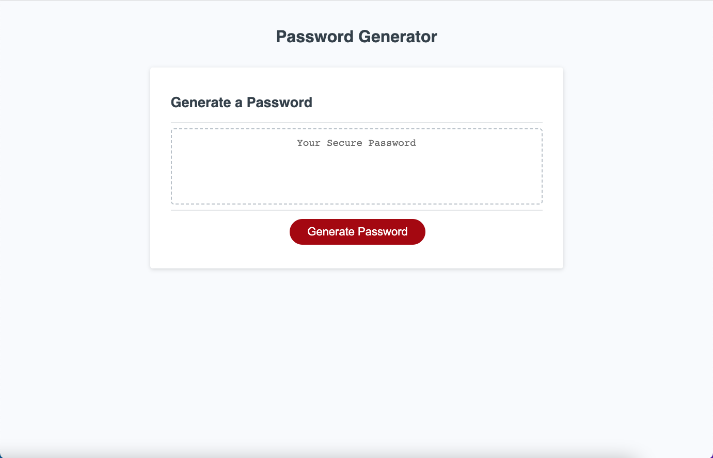

# <Password-Generator>

## Description

The random password generator helps protect data and keep it safer by generating more complex, randomized passwords. Biulding internet safety motivated the building of this generator.

## Installation

Click on the link to navigate to the random password generator. Follow the prompts once you click the generate password link.

## Usage

https://jannorth.github.io/Password-Generator/

